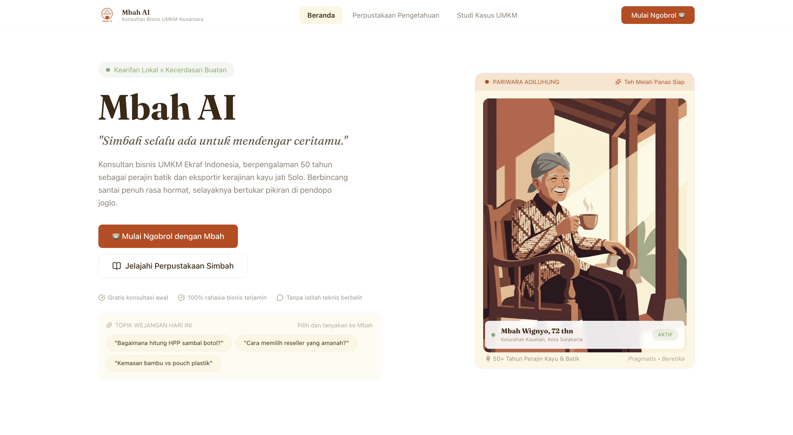
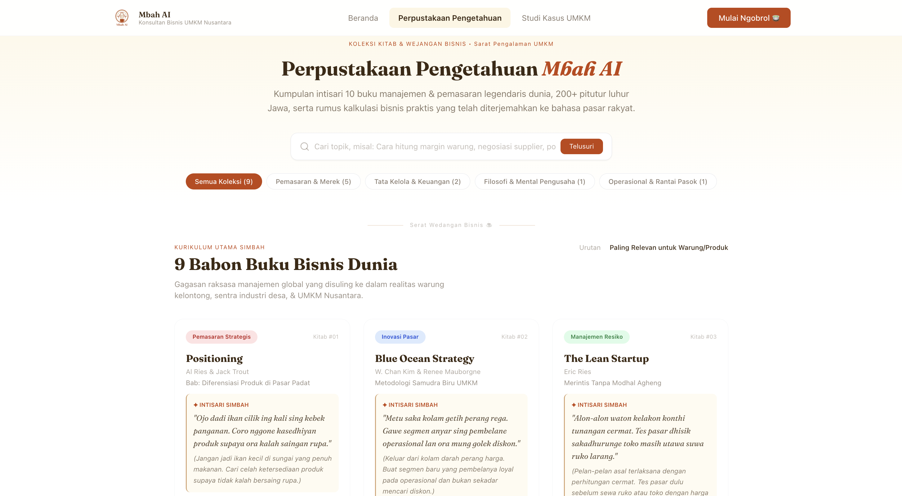
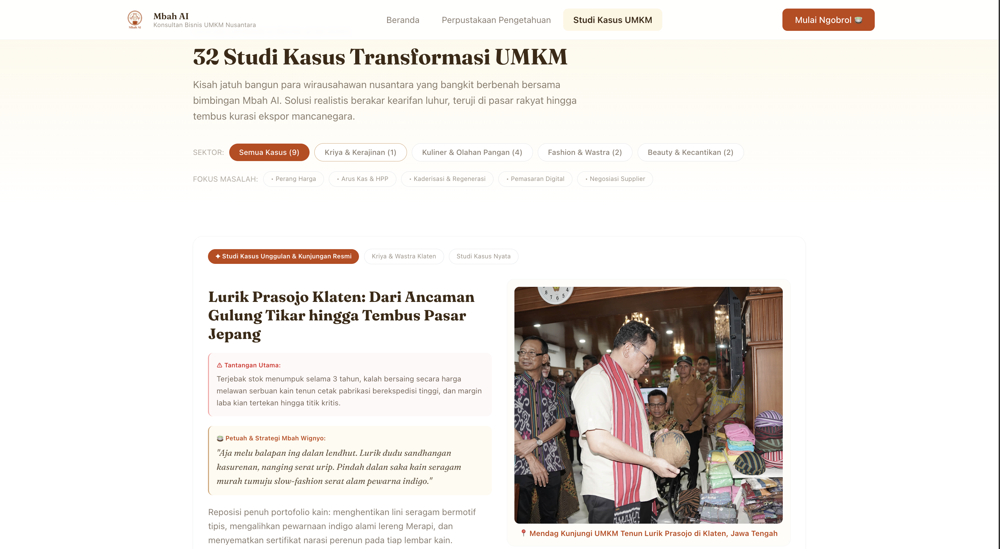
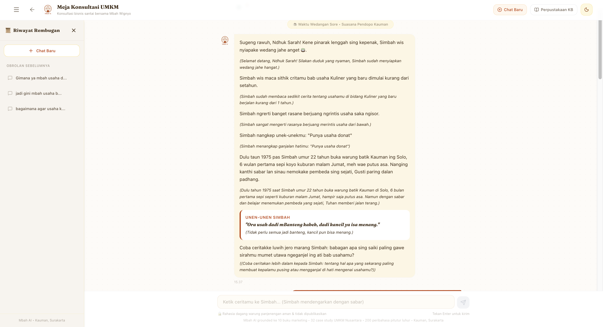

# Mbah AI — Konsultan Bisnis UMKM Ekraf Indonesia

Pernah bingung soal HPP, strategi branding, atau cara beda dari kompetitor, tapi tidak ada yang bisa ditanya? Mbah Wignyo siap membantu.

**Mbah AI** adalah chatbot konsultan bisnis berbasis AI untuk pelaku UMKM Ekonomi Kreatif Indonesia. Dibangun dengan persona **Mbah Wignyo Hadi Sudarmo** kakek Jawa bijak berusia 72 tahun, mantan perajin batik Solo & eksportir kerajinan yang menyampaikan saran bisnis grounded dari Knowledge Base 396 chunks mencakup 10 buku marketing kelas dunia, 32 case study UMKM Indonesia, dan 200+ peribahasa Nusantara.

🔗 **Live Demo:** [mbah-ai.web.app](https://mbah-ai.web.app)

📁 **GitHub:** [github.com/mchndrad/mbah-ai](https://github.com/mchndrad/mbah-ai)

---

## Latar Belakang

Indonesia punya 65 juta UMKM, tapi hanya 24.9% yang terhubung ke ekosistem digital. Kesulitan utama bukan karena malas tapi karena tidak ada akses ke konsultan bisnis yang terjangkau.

Konsultan bisnis konvensional berharga Rp 5–50 juta per sesi. Buku marketing kelas dunia seperti _Positioning_ atau _Blue Ocean Strategy_ terlalu abstrak untuk owner warung kelontong. Komunitas online sering memberikan saran tidak terstruktur.

**Insight kunci:** UMKM tidak butuh AI teknis. Mereka butuh teman ngobrol yang bijak, hangat, dan tahu banyak yang bisa menerjemahkan framework marketing kelas dunia ke bahasa mereka.

Mbah AI menjawab gap ini dengan pendekatan budaya: advice disampaikan lewat cerita pengalaman, peribahasa Jawa, dan analogi kehidupan sehari-hari yang familiar bagi mayoritas pelaku UMKM Indonesia.

---

## Submission

**Kompetisi:** Kemenekraf × Google Creative Technology Future Talent 2026
**Track:** AI
**Topik:** 1 (AI Agent/Chatbot)
**Deadline:** 9 September 2026

---

## Fitur Utama

### 1. Persona Mbah Wignyo yang Konsisten

Setiap response Mbah AI mempertahankan karakter kakek Jawa bijak:

- Panggilan hangat: "Le" (pria), "Ndhuk" (wanita), "Nak" (netral)
- Self-reference "Simbah" — tidak pernah keluar karakter
- Bahasa Indonesia dengan 20–30% sentuhan Jawa
- Selalu sertakan 1 peribahasa Nusantara yang relevan per response

### 2. RAG (Retrieval-Augmented Generation)

Setiap pertanyaan user di-search ke Knowledge Base 396 chunks menggunakan keyword scoring. Top 3 chunks paling relevan di-inject ke Gemini API sebagai context. Response grounded ke KB, bukan halusinasi.

### 3. 4-Tier Confidence Fallback System

```
TIER 1 (score > 0.6)  → Full response + citation kuat
TIER 2 (score 0.35–0.6) → Soft grounding + honest caveat
TIER 3 (score 0.1–0.35) → Pendapat Simbah dari pengalaman, no fake citation
TIER 4 (off-topic)     → Politely redirect atau refer ke expert
```

### 4. Knowledge Base 360+ Halaman

| File                          | Konten                    | Jumlah         |
| ----------------------------- | ------------------------- | -------------- |
| 01-KNOWLEDGE-BASE-Extended.md | 12 domain praktis UMKM    | 35 chunks      |
| 03-PERIBAHASA-DATABASE.md     | Peribahasa Nusantara      | 200 peribahasa |
| 04-SAMPLE-DIALOG-LIBRARY.md   | Contoh dialog Mbah        | 26 dialogs     |
| 06-MARKETING-FRAMEWORKS.md    | Framework marketing dunia | 32 frameworks  |
| 07-CASE-STUDIES-INDONESIA.md  | Case study UMKM Indonesia | 32 cases       |
| BRANDKU_Knowledge_Base_v1.pdf | 10 buku marketing pilar   | 58 halaman     |

### 5. Halaman Perpustakaan Pengetahuan

- 10 buku marketing dengan intisari & aplikasi lapangan UMKM
- Filter by kategori (Pemasaran & Merek, Tata Kelola, Filosofi, Operasional)
- Search real-time
- Kompilasi 3 peribahasa unggulan dengan aksara Jawa

### 6. Halaman Studi Kasus UMKM

- Featured case study (Lurik Prasojo Klaten)
- 9 case study dengan foto, masalah nyata, solusi Mbah, & stats
- Filter by sektor (Kriya, Kuliner, Fashion, Beauty)
- Stats dampak komunitas (32 kasus, +38% rata-rata margin)

### 7. PDF "Catatan dari Simbah"

Setelah 3+ exchanges, user bisa generate PDF 1-halaman berisi:

- Duduk Persoalane (masalah utama)
- Apa Sing Simbah Rungokake (tangkapan Simbah)
- Pangerten Saka Simbah (framework yang dipakai)
- Pitutur Simbah (3 aksi 30 hari)
- Penget Simbah (pesan penutup + peribahasa)

---

## Arsitektur Sistem

```
┌─────────────────────────────────────────────────────┐
│                   USER INTERFACE                    │
│  Landing Page → Onboarding → Chat → PDF Export      │
└─────────────────────┬───────────────────────────────┘
                      │ user message
                      ▼
┌─────────────────────────────────────────────────────┐
│              RAG SERVICE (ragService.js)            │
│  Load 396 chunks from public/kb/ → keyword search   │
│  Score chunks → top 3 diambil → tier ditentukan     │
└─────────────────────┬───────────────────────────────┘
                      │ context + tier
                      ▼
┌─────────────────────────────────────────────────────┐
│          PERSONA SERVICE (personaService.js)        │
│  System Prompt + Tier Prompt + KB Context           │
│  → assembled menjadi 1 full prompt                  │
└─────────────────────┬───────────────────────────────┘
                      │ full prompt
                      ▼
┌─────────────────────────────────────────────────────┐
│          GEMINI API (geminiService.js)              │
│  Model: gemini-3.6-flash                            │
│  System instruction: Mbah Wignyo persona            │
│  Generation config: temp 0.75, top_p 0.9            │
└─────────────────────┬───────────────────────────────┘
                      │ response text
                      ▼
┌─────────────────────────────────────────────────────┐
│              TEXT PROCESSING (textUtils.js)         │
│  Extract citations → render citation pills          │
│  Detect peribahasa → render italic gold border      │
└─────────────────────────────────────────────────────┘
```

---

## Struktur Folder

```
mbah-ai/
├── public/
│   └── kb/                         # Knowledge Base files
│       ├── 01-KNOWLEDGE-BASE-Extended.md
│       ├── 03-PERIBAHASA-DATABASE.md
│       ├── 04-SAMPLE-DIALOG-LIBRARY.md
│       ├── 05-GEMINI-FALLBACK-LOGIC.md
│       ├── 06-MARKETING-FRAMEWORKS.md
│       ├── 07-CASE-STUDIES-INDONESIA.md
│       └── BRANDKU_Knowledge_Base_v1.pdf
├── src/
│   ├── assets/
│   │   ├── simbah.png              # Ilustrasi Mbah Wignyo
│   │   └── mbahai-logo.png         # Logo Mbah AI
│   ├── components/
│   │   ├── landing/
│   │   │   ├── LandingPage.jsx     # Compose semua section
│   │   │   ├── Navbar.jsx          # Navigasi 4 item
│   │   │   ├── HeroSection.jsx     # Hero + card Mbah
│   │   │   ├── PillarSection.jsx   # 3 pilar KB
│   │   │   ├── TestimonialSection.jsx
│   │   │   ├── PerpustakaanPage.jsx # Halaman perpustakaan
│   │   │   ├── StudiKasusPage.jsx  # Halaman studi kasus
│   │   │   └── Footer.jsx
│   │   ├── onboarding/
│   │   │   └── OnboardingModal.jsx # Modal 3 pertanyaan
│   │   └── chat/
│   │       ├── ChatPage.jsx        # Halaman chat utama
│   │       ├── ChatHeader.jsx      # Header + tombol PDF
│   │       ├── MessageBubble.jsx   # Bubble chat Mbah + user
│   │       ├── LoadingBubble.jsx   # Animasi loading Mbah
│   │       ├── CitationPill.jsx    # Pill referensi buku/case
│   │       └── InputBox.jsx        # Input chat
│   ├── services/
│   │   ├── kbLoader.js             # Load KB dari public/kb/
│   │   ├── ragService.js           # RAG keyword search
│   │   ├── geminiService.js        # Gemini API integration
│   │   ├── personaService.js       # Assemble prompt + kirim
│   │   └── pdfService.js           # Generate PDF Catatan Simbah
│   ├── store/
│   │   └── useAppStore.js          # Zustand state + localStorage
│   ├── prompts/
│   │   ├── systemPrompt.js         # Persona Mbah lengkap
│   │   └── tierPrompts.js          # Prompt per tier 1-4
│   ├── utils/
│   │   ├── vectorUtils.js          # Cosine similarity helper
│   │   └── textUtils.js            # Chunking + citation parser
│   ├── styles/
│   │   └── globals.css             # Tailwind + custom styles
│   ├── App.jsx                     # Root routing 4 halaman
│   └── main.jsx                    # React entry point
├── .gitignore
├── index.html
├── package.json
├── postcss.config.js
├── tailwind.config.js
├── vite.config.js
└── README.md
```

---

## Design System

### Color Palette

| Token             | Hex       | Penggunaan                      |
| ----------------- | --------- | ------------------------------- |
| `mbah-white`      | `#FFFFFF` | Background utama                |
| `mbah-cream`      | `#FDF6E3` | Background bubble Mbah, card    |
| `mbah-terracotta` | `#C1440E` | CTA button, user bubble, accent |
| `mbah-sage`       | `#87A96B` | Citation buku, badge aktif      |
| `mbah-brown`      | `#3D2914` | Text primary                    |
| `mbah-gold`       | `#D4A574` | Accent, border peribahasa       |

### Typography

| Penggunaan         | Font               | Weight  |
| ------------------ | ------------------ | ------- |
| Heading / Display  | Fraunces (serif)   | 400–700 |
| Body / UI          | Inter (sans-serif) | 400–600 |
| Peribahasa / Quote | Fraunces italic    | 400     |

### Komponen Kunci

**Mbah Bubble:** `bg-mbah-cream`, rounded `16px 16px 16px 4px`, border coklat lembut

**User Bubble:** `bg-mbah-terracotta`, text putih, rounded `16px 16px 4px 16px`

**Peribahasa:** italic Fraunces, `border-l-2 border-mbah-gold`, background cream

**Citation Pill:**

- 📖 Buku: `bg-mbah-sage/10 text-mbah-sage`
- 🌾 Case Study: `bg-mbah-terracotta/10 text-mbah-terracotta`

---

## Tech Stack

| Layer            | Teknologi                              |
| ---------------- | -------------------------------------- |
| Frontend         | React 18 + Vite                        |
| Styling          | TailwindCSS v3                         |
| Animation        | Framer Motion                          |
| State Management | Zustand + localStorage persist         |
| AI / LLM         | Google Gemini API (`gemini-3.6-flash`) |
| SDK              | `@google/generative-ai`                |
| PDF Export       | jsPDF                                  |
| Icons            | Lucide React                           |
| Storage          | localStorage (no backend DB)           |
| Deployment       | Vercel via GitHub                      |

---

## Knowledge Base Depth

Framework yang dipakai Mbah AI mencakup 3 layer:

**Layer A — 10 Buku Marketing Pilar Dunia**
Positioning (Al Ries & Jack Trout) · Building a StoryBrand (Donald Miller) · How Brands Grow (Byron Sharp) · Managing Brand Equity (David Aaker) · The Brand Gap (Marty Neumeier) · This Is Marketing (Seth Godin) · Contagious (Jonah Berger) · Purple Cow (Seth Godin) · Start with Why (Simon Sinek) · Hooked (Nir Eyal)

**Layer B — 10 Buku Bisnis & Growth Tambahan**
Blue Ocean Strategy · Crossing the Chasm · The Innovator's Dilemma · Made to Stick · Influence (Cialdini) · Predictably Irrational · The Lean Startup · Zero to One · The Personal MBA · Small Giants

**Layer C — 12 Framework Praktis**
AIDA · STP · 4P/7P Marketing Mix · SWOT · Porter's Five Forces · Business Model Canvas · Value Proposition Canvas · Jobs-to-be-Done · Customer Journey Mapping · RACE · Growth Loops · Product-Market Fit

**32 Case Study UMKM Indonesia:**
Kopi Tuku · Erigo · Wardah · Sejauh Mata Memandang · Somethinc · Kopi Kenangan · Mie Gacoan · Torajamelo · Sensatia Botanicals · Torch · Cotton Ink · Bittersweet by Najla · Lemonilo · Kahf · Haus! · Fore Coffee · Warung Kopi Kulo · Sabana FC · Rocket Chicken · Sasa · Batik Fractal · Chatime · Rollover Reaction · Cap Lang · dan 8 lainnya.

**200+ Peribahasa Nusantara** dari Jawa, Sunda, Melayu, Betawi — dikategorikan by konteks bisnis (pricing, competition, patience, integrity, growth, dll).

---

## Cara Jalanin

### Prerequisites

- Node.js 18+
- Gemini API Key (gratis di [aistudio.google.com](https://aistudio.google.com/app/apikey))

### Installation

```bash
git clone https://github.com/mchndrad/mbah-ai.git
cd mbah-ai
npm install
```

### Setup Environment

```bash
cp .env.example .env
```

Edit `.env`:

```
VITE_GEMINI_API_KEY=your_gemini_api_key_here
```

### Copy KB Files

Copy semua file KB ke `public/kb/`:

```
public/kb/
├── 01-KNOWLEDGE-BASE-Extended.md
├── 03-PERIBAHASA-DATABASE.md
├── 04-SAMPLE-DIALOG-LIBRARY.md
├── 05-GEMINI-FALLBACK-LOGIC.md
├── 06-MARKETING-FRAMEWORKS.md
├── 07-CASE-STUDIES-INDONESIA.md
└── BRANDKU_Knowledge_Base_v1.pdf
```

### Run Development Server

```bash
npm run dev
```

Buka `http://localhost:5173`.

### Build Production

```bash
npm run build
```

---

## Deploy ke Firebase Hosting

1. Install Firebase CLI

```bash
npm install -g firebase-tools
```

2. Login ke Firebase

```bash
firebase login
```

3. Init project

```bash
firebase init hosting
```

Pilih opsi:

- Public directory: `dist`
- Configure as single-page app: `Yes`
- Set up automatic builds with GitHub: `Yes` (opsional)

4. Build project

```bash
npm run build
```

5. Deploy

```bash
firebase deploy
```

Dapat URL: `https://mbah-ai.web.app`

**Auto-deploy via GitHub Actions** (opsional):
Saat `firebase init` pilih GitHub Actions — setiap push ke `main` akan auto-deploy.

---

## User Flow

```
Landing Page
    │
    ├── Navbar: Perpustakaan Pengetahuan → halaman buku + peribahasa
    ├── Navbar: Studi Kasus UMKM → halaman case study
    │
    └── Klik "Mulai Ngobrol dengan Mbah"
              │
              ▼
        Onboarding Modal (3 step)
        1. Jenis usaha (17 subsektor ekraf)
        2. Lama usaha (<1 / 1-2 / 3-5 / >5 tahun)
        3. Tantangan utama (textarea)
              │
              ▼
        Chat dengan Mbah
        • Greeting personalized berdasarkan onboarding
        • User kirim pertanyaan
        • RAG search KB → tier ditentukan
        • Gemini generate response sebagai Mbah Wignyo
        • Citation pills muncul (buku 📖 / case study 🌾)
        • Peribahasa di-render italic dengan gold border
              │
              ▼ (setelah 3+ exchanges)
        Tombol "Catatan Simbah" muncul di header
              │
              ▼
        Generate PDF 1-halaman
        • Ringkasan masalah + solusi Mbah
        • Framework yang dipakai + citation
        • 3 aksi konkret 30 hari
        • Peribahasa penutup
```

---

## Contoh Response Mbah

**User:** "Mbah, warung saya sepi terus padahal makanannya enak. Gimana ya biar rame?"

**Mbah Wignyo:**

> Oalah Nak... Simbah paham betul rasanya. Sudah capek-capek masak dari subuh, bumbu sudah pas, tapi yang datang cuma angin lewat. Rasanya nyesek.
>
> Dulu tahun 1975 pas Simbah pertama buka warung batik di Kauman Solo, 6 bulan pertama sepi kayak kuburan malam Jumat. Sampai hampir jual perhiasan Bu Endang. Tapi Simbah sadar — bukan masalah kualitasnya. Masalahnya tidak ada yang tahu Simbah ada di sana.
>
> _"Ora usah dadi mBanteng kabeh, dadi kancil ya isa menang."_
> (Tidak perlu jadi banteng, kancil pun bisa menang.)
>
> Al Ries dalam bukunya tentang Positioning bilang — orang tidak beli yang terbaik, mereka beli yang mereka ingat. Warung enak tapi tidak ada yang tahu = tidak ada bedanya dengan tidak ada. Kopi Tuku di Cipete Jakarta juga pernah begini. Gang sempit, tidak ada papan nama besar. Yang mereka lakukan: fokus jadi "kopi susu untuk anak sekolah 15rb" — satu positioning yang jelas sampai semua orang ngomong ke temannya.
>
> Coba minggu ini: (1) Foto produk terbaik satu menu andalanmu, posting di WhatsApp Status setiap pagi jam 7 selama 7 hari berturut-turut. (2) Tulis di pintu warung tagline sederhana yang bikin orang curious: "Warung yang bikin kangen pulang kampung". (3) Minta 5 pembeli pertama hari ini untuk foto dan tag di IG Stories.
>
> Simbah mau tanya: dari semua menu yang ada di warungmu, mana 1 menu yang paling sering dipuji pembeli?

---

## Peribahasa yang Sering Dipakai Mbah AI

| Peribahasa                                              | Arti                                             | Konteks Bisnis          |
| ------------------------------------------------------- | ------------------------------------------------ | ----------------------- |
| Ora usah dadi mBanteng kabeh, dadi kancil ya isa menang | Tidak perlu jadi banteng, kancil pun bisa menang | Positioning, persaingan |
| Ana rega ana rupa                                       | Ada harga ada kualitas                           | Pricing strategy        |
| Alon-alon waton kelakon                                 | Pelan-pelan asal terlaksana                      | Sustainable growth      |
| Urip iku urup                                           | Hidup itu menyalakan (manfaat)                   | Purpose-driven business |
| Jer basuki mawa beya                                    | Kemajuan butuh pengorbanan                       | Modal & investasi       |
| Ajining diri saka lathi                                 | Harga diri dari ucapan/janji                     | Integritas bisnis       |
| Sing sabar iku momot                                    | Yang sabar itu kuat                              | Ketahanan mental        |
| Ojo kesusu, sing telaten mesti nyandhak                 | Jangan buru-buru, yang telaten pasti berhasil    | Long-term thinking      |

---

## Screenshots

## Screenshots

### Landing Page


### Perpustakaan Pengetahuan


### Studi Kasus UMKM


### Chat Interface


---

## Batasan & Catatan

- **No backend database** — chat history disimpan di localStorage browser
- **KB tidak update realtime** — diperbarui manual saat ada update signifikan
- **Gemini free tier** — rate limit ~15 RPM; untuk production scale perlu upgrade
- **PDF export** menggunakan jsPDF — layout sederhana, tidak support custom font embedding penuh
- **RAG menggunakan keyword matching** (bukan embedding vector) — lebih cepat startup tapi akurasi lebih rendah dari semantic search

---

## Tentang Pembuat

**Muhamad Chandra Darmawan**
Developer · Final Proyek Ekraf 2026

GitHub: [@mchndrad](https://github.com/mchndrad) · LinkedIn: [muhamadchandra9](https://linkedin.com/in/muhamadchandra9) · Email: muhamadchandra.d19@gmail.com

---

## Lisensi

MIT License — bebas untuk personal & edukasi.

---

_"Ojo kesusu, sing telaten mesti nyandhak."_
_(Jangan buru-buru, yang telaten pasti berhasil.)_

🍵 — Mbah Wignyo Hadi Sudarmo, Kauman, Solo
